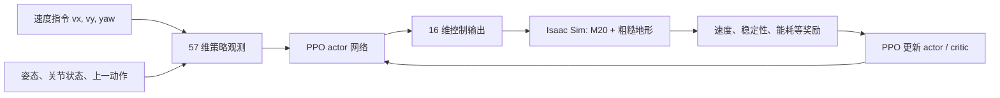

# M20 强化学习训练说明

本次训练的任务是 `Rough-Deeprobotics-M20-v0`。它不是让机器人无目标地
“跑得越快越好”，而是一个**给定速度指令的轮腿机器人控制器**：在 Isaac Sim
物理仿真中，M20 根据自身状态与期望速度，输出腿部和轮子的控制量。

## 训练目标

目标是同时做到：

1. 跟踪机身速度指令，包括前后 `vx`、横移 `vy` 和偏航角速度 `yaw`；
2. 在楼梯、台阶、随机粗糙地、上坡和下坡上不翻倒；
3. 控制动作平滑，减小不必要的关节力矩、加速度、碰撞和轮子打滑；
4. 让四个轮腿在转向时保持合理的交替接触与对称性。

它不是路径规划器，也不接收相机图像或目标点。部署时若要让它去某处，需要
上层模块持续提供速度指令。

## 输入：策略实际看到的 57 个数

本次运行日志确认 actor 网络输入为 57 维。每一个控制周期（`0.02 s`）输入：

| 内容 | 维度 | 用途 |
| --- | ---: | --- |
| 机身角速度 | 3 | 感知滚转、俯仰和偏航动态。 |
| 投影重力方向 | 3 | 感知当前姿态是否倾斜。 |
| 期望速度 `(vx, vy, yaw)` | 3 | 明确告诉策略要静止、直行、横移或转向。 |
| 16 个关节位置特征 | 16 | 感知四条轮腿的当前构型。 |
| 16 个关节速度 | 16 | 感知腿和轮子的运动状态。 |
| 上一时刻的 16 个动作 | 16 | 帮助输出连续、平滑的控制。 |

M20 的 actor **不直接使用高度扫描**，也不直接使用机身线速度；它通过关节、
IMU 类状态和速度指令作出反应。训练阶段的 critic 使用 247 维特权信息：在 actor
观测之外增加机身线速度和 187 个地形高度扫描点。这种 asymmetric actor-critic
训练可让 critic 更容易估计价值，同时部署的 actor 不依赖地形扫描器。

## 输出：16 个控制量

网络输出为 16 维：

| 输出 | 数量 | 含义 |
| --- | ---: | --- |
| 腿部关节位置目标 | 12 | 每条腿的 hip-x、hip-y、knee 三个关节，相对默认站立姿势的目标。hip-x 动作缩放为 `0.125 rad`，其余腿关节为 `0.25 rad`。 |
| 轮子关节速度目标 | 4 | 四个轮子的速度控制，动作缩放为 `5 rad/s`。 |

Isaac Sim 的物理引擎执行这些目标，得到下一时刻状态与奖励；网络并不直接输出
“前进距离”或“上楼梯”这类高层指令。

## 地形与随机化

`Rough` 任务的地形生成器为每个子环境构建 8 m × 8 m 地块，默认比例为：

| 地形 | 比例 | 参数 |
| --- | ---: | --- |
| 正向金字塔楼梯 | 20% | 台阶高 5–23 cm、宽 30 cm。 |
| 反向金字塔楼梯 | 20% | 台阶高 5–23 cm、宽 30 cm。 |
| 台阶盒子 | 20% | M20 配置将高度设为 2.5–20 cm。 |
| 随机粗糙高度场 | 20% | M20 配置将高度扰动设为 1–16 cm。 |
| 上坡 / 下坡 | 各 10% | 坡度最高 0.4。 |

训练还随机化摩擦（0.35–1.5）、弹性（0–0.7）、质量、质心、初始姿态和初始
速度，使控制器不只适配一种理想模型。地形课程仍处于开启状态；完成训练时记录
的平均 terrain level 为 4.01。

## 速度指令与为什么视频前慢后快

指令每 **10 秒**重采样一次，范围为：

| 指令 | 范围 |
| --- | --- |
| `vx` | -2 到 2 m/s |
| `vy` | -1 到 1 m/s |
| `yaw` | -2 到 2 rad/s |

其中 20% 环境采样零速度，另有专门的横移、直行和纯转向样本。现有 seed 42 回放
在前 10 秒处于近静止指令；第 10 秒命令重采样，最终模型才在最后两秒加速。该段
轨迹中，checkpoint 4999 最后两秒的平均平面速度为 `0.814 m/s`，峰值为
`1.13 m/s`；checkpoint 0 同期只有 `0.012 m/s`。这是单条随机指令轨迹，不能
作为最大速度或爬楼通过率的评测。

## 奖励

每个控制周期的总奖励是下列项的加权和。最重要的正向项为：

| 奖励 | 权重 | 作用 |
| --- | ---: | --- |
| XY 线速度跟踪 | +5.0 | 让实际平面速度接近期望 `(vx, vy)`。 |
| 偏航角速度跟踪 | +3.0 | 让实际转向速度接近期望 yaw。 |
| 转向步态状态 | +2.0 | 鼓励转向时合理接触。 |
| 转向步态对称 | +15.0 | 鼓励对角轮腿组的接触对称。 |
| 转向时的轮子腾空时间 | +50.0 | 鼓励合适的轮腿转向节律。 |

同时施加惩罚：机身倾斜 `-50`、严重姿态错误 `-1000`、垂直速度、横滚/俯仰
角速度、腿关节力矩和加速度、动作变化率 `-0.01`、动作不平滑 `-0.025`、非轮子
部位碰撞、轮子接触力和转向时滑动。策略因此要在速度、稳定和控制成本之间折中。

## 算法与本次规模

使用 PPO（近端策略优化），不是监督学习或模仿学习。actor 和 critic 均为
`512 → 256 → 128` 的 ELU MLP；每次更新收集 2048 个并行环境各 24 步，即
49,152 条转移，再进行 5 个学习 epoch、4 个 minibatch 的 PPO 更新。

本次运行使用 2048 个环境、5000 次更新，合计约 2.46 亿条环境转移；最终
checkpoint 是 `model_4999.pt`。PPO 配置包括 `gamma=0.99`、`lambda=0.95`、
clip ratio `0.2`、初始学习率 `1e-3` 和自适应学习率调度。

## 如何正确评价上楼梯

“训练见过楼梯”不等于“已经稳定上楼”。应固定正向楼梯、反向楼梯和速度指令，
对多个随机种子统计成功率、翻倒率、速度误差与滑动。早先的 CPU 视频没有带入
Isaac Sim 地形网格，只能展示关节动作与速度响应，不能作为楼梯能力证据。新版
轨迹导出脚本会保存地形高度扫描和指令，以便在服务器恢复后生成带地形轮廓及
期望/实际速度叠加的评测视频。

## 代码入口

- 任务配置：`source/rl_training/rl_training/tasks/manager_based/locomotion/velocity/config/wheeled/deeprobotics_m20/rough_env_cfg.py`
- 通用环境、观测与地形：`source/rl_training/rl_training/tasks/manager_based/locomotion/velocity/velocity_env_cfg.py`
- PPO 配置：`source/rl_training/rl_training/tasks/manager_based/locomotion/velocity/config/wheeled/deeprobotics_m20/agents/rsl_rl_ppo_cfg.py`
- 训练脚本：`scripts/reinforcement_learning/rsl_rl/train.py`
